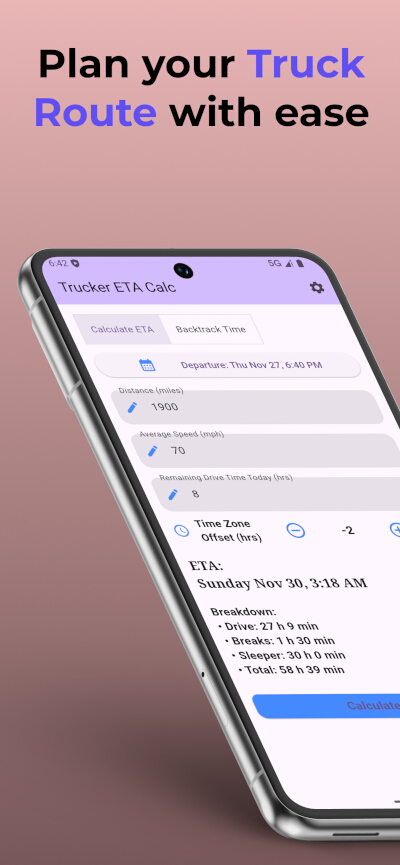
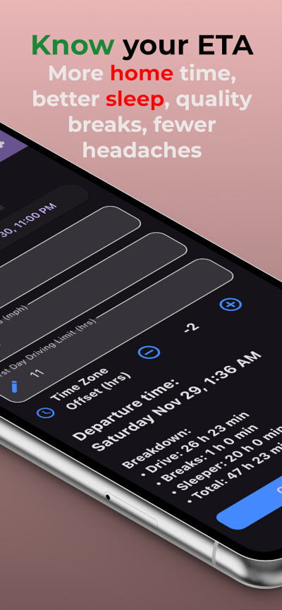
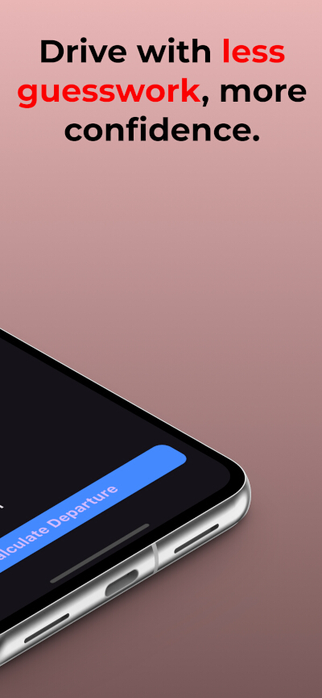

  

  <h1 style="margin:0;"> Truck Route ETA</h1>

Smarter planning for truckers. More home time, better sleep, longer breaks, fewer headaches.

---

## 📱 About the App
**Truck Route ETA** is built for drivers who want less stress and more control.  
Know your ETA at every stop, plan smarter breaks, and stay compliant with HOS rules without the guesswork.

---

## ⭐ Benefits
- **Accurate ETA** → Know exactly when you’ll arrive.  
- **Backtrack logic** → Plan departures from appointments with confidence.  
- **HOS compliance** → Respect real Hours of Service rules automatically.  
- **Peace of mind** → More rest, more family time, less stress.  
- **Simple design** → Clean, bilingual interface that feels natural on iPhone.

---

## 🖼️ Screenshots
Here’s a preview of the app in action:

  

    
    
<em>Clean and simple easy to use design.</em>

  

  

    
    
<em>Precise ETA calculation with HOS rules.</em>

  

  

    
    
<em>Plan departures backwards from appointments.</em>

  

  

    
    
<em>Modern design that adapts to your workflow.</em>

  

---

## ✨ Why Truck Route ETA?
Because every mile matters. With smarter planning, you get more control over your day — and more time for what really counts.

*Support information* contact: *truckaxlecalc@gmail.com*

 
